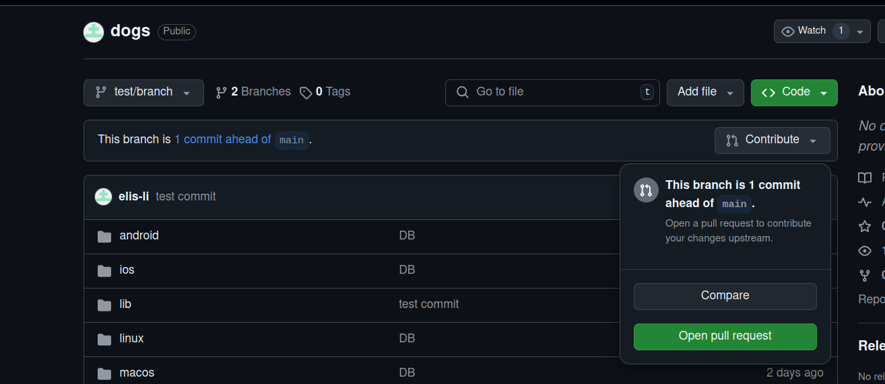
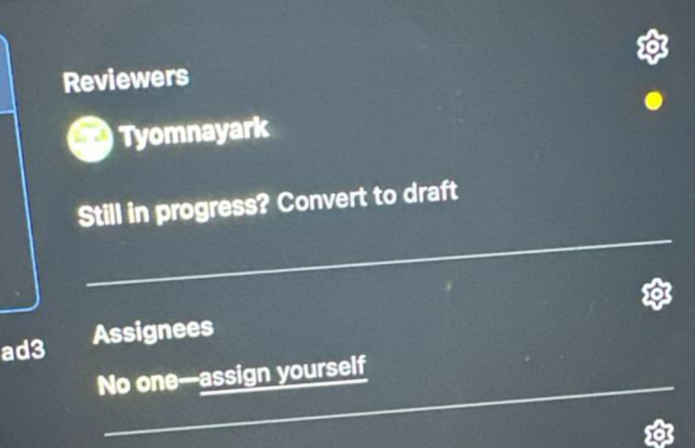

# dogs

A new Flutter project.

## Getting Started

This project is a starting point for a Flutter application.

A few resources to get you started if this is your first Flutter project:

- [Lab: Write your first Flutter app](https://docs.flutter.dev/get-started/codelab)
- [Cookbook: Useful Flutter samples](https://docs.flutter.dev/cookbook)

For help getting started with Flutter development, view the
[online documentation](https://docs.flutter.dev/), which offers tutorials,
samples, guidance on mobile development, and a full API reference.
# dogs


# GIT FLOW for Dogs project

## Инструкция для уважаемой Елизаветы, как работать по GIT FLOW

- <b> НИКОГДА</b> не работаем в ветке main

- В начале дня создаем ветку, название которой даем исходя из текущей задачи в формате topic/your_task_name,
 где topic - общая специфика задачи, могут быть варианты, к примеру <b>ui/, logic/, feature/...</b>

    <b>your_task_name</b> - более конкретное описание задачи, например <b>add_search_bar</b>, но тк для удобства условимся,
    что ты создаешь ветку утром и пул реквест отправляешь в конце дня, если нет критических ошибок (проект собирается и запускается),
    то можешь давать вот такие названия <b>september_26, то есть ui/september_26, feature/april_2 </b>

- Когда работа готова, в конце дня (если что-то не доделала пофиг, главное чтобы проект не был ломаный, спокойно запускался, только в этом случае не отправляешь,
 я потому что каждый день буду ждать твои пул реквесты, хехе) делаешь пул реквест через брайзерный гит (добавляешь меня в reviewers, себя в assignes)





- Ждешь мои комментарии, читаешь, споришь, исправляешь (то есть ты после того, как открыла пул реквест, также можешь пушить изменения в эту ветку, в общем работаешь как обычно)
К каждому комментарию <b>ОБЯЗАТЕЛЬНО</b> писать ответ

 
## Подсказка по командам:

## Для создания новой ветки 
(при этом надо находиться на ветке, которую ты хочешь, чтобы скопировала новая, то есть
в твоем случае на main, при чем актуализированную с помощью git pull, см ниже)   

```
 git checkout -b "topic/your_task_name"
```
     
## Для переключаения между ветками 
 (переключение на мейн, чтобы скопировать обновленные данные после вливания веток, вместо main можно указать название любой существующей ветки для переключения)
```
git checkout main 
```

     
## Для того, чтобы загрузить обновленные данные после слияния веток 
(надо находиться на ветке при этом, то есть сначала сделать checkout на нее, для которой ты хочешь
 скачать обновления, у тебя это будет чаще всего main, тк мы туда все пул реквесты направляем)

```
 git pull
```
     
## Чтобы вывести в терминал список всех существующих веток 
(на которой находишься в данный момент, будет помечена)
```
  git branch
  ``` 
